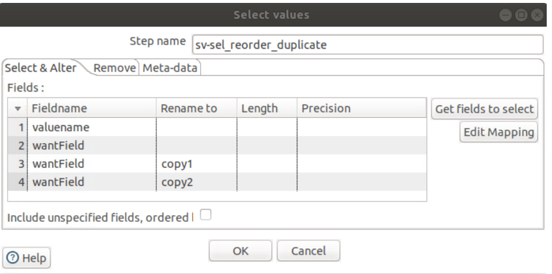

##  Create the Transformation and Add the Generate Rows Step
In this section of the exercise, you create a new transformation, and then add, configure, and preview the
Generate rows step to add 10 rows with three fields to the stream.

1. To create a new transformation, on the toolbar, click the New file button, and then select
Transformation.
2. To add a Generate rows step to the transformation:
    - Click to view the Design tab.
    - Expand the Input category.
    - Drag the Generate rows step from the Design tab to the canvas.
3. To configure the Generate rows step, on the canvas, double-click the Generate rows step.
4. Enter values in the properties of the Generate rows dialog as follows:

    |Property Name | Value         |
    |--------------|---------------|
    |Step name     | gr-demo fields|
    |Limit         | 10            |

5. To configure the Fields grid, add three rows as shown:

    |Name              | Type    | Format     | Value                             |
    |------------------|---------|------------|-----------------------------------|
    |wantField         | String  |            |PDI solves integration challenges. |
    |dontWantField     | Integer | #          | 1                                 |
    |dontWantDateField | Date    | MM/dd/yyyy | 05/21/1956                        |

*You must use the exact case and spelling as shown.*

6. To preview the data and confirm it is configured properly, click Preview, and then in the Enter
preview size dialog, click OK.
7. Verify the data generated is correct by comparing your data with the screenshot:

8. To close the Examine preview data dialog, click Close.
9. To close the Generate rows dialog, click OK.
10. To save the transformation, on the toolbar, click the Save button.
11. Navigate to the `/home/pentaho/course_files/pdi1000l/my_work `folder, then in the File
name, type `ex1_select_values` and then click OK.

##  Add and Configure the Add Sequence Step
In this section of the exercise, you add an Add sequence step to the transformation, and then add a hop from
the gr-demo_fields step. The Add sequence step will add a field to the stream with a sequence number for
each row. You then preview the transformation.

1. To add an Add sequence step to the transformation, on the Design tab:
    - In the Steps search field, type: add seq
    - Drag the Add sequence step from the Design tab to the canvas and drop it to the right of
    the gr-demo_fields step.
2. To create a hop from the gr-demo_fields step to the Add sequence step, on the canvas:
    - Press and hold the Shift key.
    - Click and hold the gr-demo_fields step.
    - Point to the Add sequence step, and then release.
3. To rename the step using best practice naming standards, double-click the Add sequence step and
change the Step name property to: `aseq-valuename`

    This step name was chosen because the step is an Add sequence step (aseq) and the step will add
    a new field named valuename to the stream.

4. To preview the `aseq-valuename` step:
    - On the canvas, click to select the `aseq-valuenam`e step.
    - From the menu, click Action → Preview.
    - Click the Quick Launch button.

5. Verify the preview data has all the first step’s fields as well as the new field named valuename.

6. To close the Examine preview data dialog, click Close.
7. To close the Select the preview step dialog, click Close.
8. To close the Add sequence step’s configuration dialog, click OK.
9. Save the transformation.

## Add and Configure the Select Values Step
In this section of the exercise, you add and configure a Select values step to select fields that you want to
keep in the stream, copy a field in the stream, including its data, and add it to the stream as a new field. You
duplicate the wantField twice. You’ll then preview the Select values step.

1. To add a Select values step to the transformation, on the Design tab:
    - In the Steps search field, type: select
    - Drag the Select values step from the Design tab to the canvas and drop it to the right of the
    Add sequence step.
2. To create a hop from the aseq-valuename step to the Select values step, on the canvas:
    - Press and hold the Shift key.
    - Click and hold the aseq-valuename step.
    - Point to the Select values step, and then release
3. Name the step: `sv-sel_reorder_duplicate`
4. Complete the Fields grid of the Select & Alter tab as follows:

    |Field Name | Rename to |
    |-----------|-----------|
    |valuename  | <empty>   |
    |wantField  | <empty>   |
    |wantField  | copy1     |
    |wantField  | copy2     |

5. Compare the step’s configuration with the following screenshot and make any necessary changes.
Then, click OK.

6. To preview the duplicate fields from the `sv-sel_reorder_duplicate` step:
    - On the canvas, click to select the `sv-sel_reorder_duplicate` step.
    - From the menu, click Action Preview.
    - Click the Quick Launch button.
7. Verify the preview data has the `valuename`, `wantField`, and then two copies of the `wantField`.
8. To close the Examine preview data dialog, click Close.
9. To close the Select the preview step dialog, click Close
10. Save the transformation.
11. Close the ex1_select_values tab

## Solution Details
The solution to this exercise can be found at:
`/home/pentaho/course_files/pdi1000l/solutions/exercises`
File:
`ex1_select_values.ktr`
