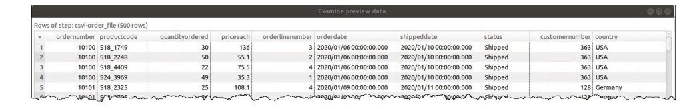
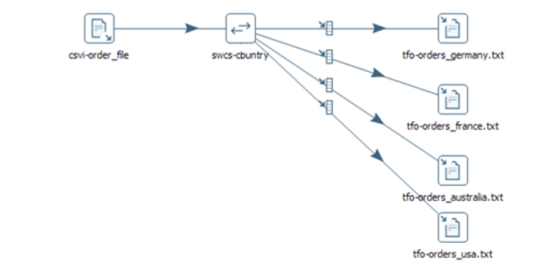

# Excercise 2 CSV Input to Multiple Text Output Using Switch/Case

## Creating the Transformation and Adding Transformation Parameters
In this section of the exercise, you create a new transformation, and add transformation parameters to define
the input and output folders.

1. To create a new transformation, on the toolbar, click the New file button, and then select
Transformation.
2. To name the transformation and save it to the `PDI_Trn_Objects `folder, in the Save dialog:
    - Click `>` to expand the Public folder.
    - Click to select the `PDI_Trn_Objects` folder.
    - In the File name, type `ex2_csv_input_text_output`
    - Click Save.
3. To open the Transformation properties dialog, on the canvas, double-click an empty area.
4. To create the transformation parameters, in the Transformation properties dialog:
    - Click the Parameters tab.
    - Create two new parameters according to the table below:

    |Parameter | Default Value |
    |----------|---------------|
    |KTR_DIR_INPUT | /home/pentaho/course_files/pdi1000l/data_files input |
    |KTR_DIR_OUTPUT | /home/pentaho/course_files/pdi1000l/data_files/output2
    *Note: This folder does not exist, but it will be created for you when the transformation executes. This parameter will override the variable with the same name.* |

    - Click OK.
5. Save the transformation.

## Configure the CSV File Input Step with a Parameter
In this section of the exercise, you add and configure the CSV file input step with a parameter identifying the input file folder.

1. To add a CSV file input step, on the Design tab, expand the Input category, and drag the CSV file
input step to the canvas.
2. To configure the CSV file input step, on the canvas, double-click the CSV file input step.
3. To name the step, in the Step name, type `csvi-order_file`
4. To use the `KTR_DIR_INPUT` parameter:
    - Click in the Filename field.
    - On the keyboard, press Ctrl-Space.
    - From the list of variables, double-click `KTR_DIR_INPUT`.
5. To append the filename to the variable, in the Filename field, after the variable, type
`/order_file.csv`
6. To change the separator, in the Delimiter, type a semicolon `;`
7. To turn off lazy conversion, click to deselect the Lazy conversion? checkbox.
8. To populate the Fields grid:
    - Click the Get Fields button.
    - In the Sample data dialog, change the value to 0.
    - Click OK.
9. To preview the data and confirm it is configured properly, click Preview, and then click OK.
10. Verify the data generated is correct by comparing your data with the screenshot:



11. To close the Examine preview data dialog, click Close.
12. To close the `csvi-order_file` dialog, click OK.
13. Save the transformation.

## Configure the Switch/Case Step
In this section of the exercise, you add and configure the Switch/case step to define a condition where the Country equals Germany, France, Australia, or USA.

1. To add a Switch/case step to the transformation, on the Design tab:
    - Click to expand the Flow category.
    - Drag the Switch/case step from the Design tab to the canvas and drop it to the right of the
    csvi-order_file step.
2. To create a hop from the csvi-order_file step to the Text file output step, on the canvas:
    - Press and hold the Shift key.
    - Click and hold the csvi-order_file step.
    - Point to the Switch/case step, and then release.
    - From the context menu, select Main output of step.
3. To configure the Switch/case step, on the canvas, double-click the Switch/case step.
4. To name the step, in the Step name, type swcs-country
5. To specify the field name to switch, from the Field name to switch dropdown list, and then select
country.
6. To set the value comparison to contain the specified value (instead of exactly match), check the Use string contains comparison checkbox.
7. To set the data type of the case value, from the Case value data type dropdown list, select String.
8. To set the case values, in the Case values grid, add four values for Germany, France,
Australia, and USA

*The remaining properties of this step will automatically get set as you configure the rest of the transformation.*

9. To close the Switch/case dialog, click OK.
10. Save the transformation

## Configure the Germany Text File Output Step with a Conditional Hop
In this section of the exercise, you add and configure a Text file output step using a parameter to define the
output file location. Since the output file will only contain results for Germany, you add a conditional hop
from the Switch/case step.

1. To add a Text file output step to the transformation, on the Design tab:
    - Click to expand the Output category.
    - Drag the Text file output step from the Design tab to the canvas and drop it to the right of
    the swcs-country step.
2. To create a hop from the swcs-country step to the Text file output step, on the canvas:
    - Press and hold the Shift key.
    - Click and hold the swcs-country step.
    - Point to the Text file output step, and then release.
    - From the context menu, select the case target for value Germany.
3. To configure the Text file output step, on the canvas, double-click the Text file output step.
4. To name the step, in the Step name, type `tfo-orders_germany.txt`
5. To use the `KTR_DIR_OUTPUT` parameter:
    - Click in the Filename field.
    - Delete the word “file”.
    - On the keyboard, press Ctrl-Space.
    - From the list of variables, double-click `KTR_DIR_OUTPUT`.
6. To append the filename to the variable, in the Filename field, after the variable, type
`/orders_germany`
7. To configure the fields to include in the output file, click the Fields tab.
8. To obtain the fields via the hop, click the Get Fields button.
9. To close the Text file output dialog, click OK.
10. Save the transformation.

## Configure the Remaining Text File Output Steps with Conditional Hops
In this section of the exercise, you duplicate the Text file output step three times and then configure the
outputs for France, Australia, and USA, and add conditional hops from the Switch/case step. Using this
duplicate step technique saves you valuable time since the steps are configured nearly identically. Only the
step names and the filenames they create are different.

11. To duplicate the tfo-orders_germany.txt step, right-click the step, and then use the Duplicate
option from the context menu.
12. Duplicate it two more times
13. Edit each of the duplicate steps and update the step name and the Filename properties. Use the
screenshot below for guidance.
14. Create hops between the swcs-country and each of the remaining Text File output steps, making
sure to choose the case target values from the pop-up menu. For example, the case target France
goes to the tfo-orders_france.txt step.



15. Save the transformation.

## Configure the Dummy (do nothing) Step with a Conditional Hop
In this section of the exercise, you add and configure a Dummy (do nothing) step for all the countries that do
not match the Switch/case condition using a conditional hop from the swcs-country step.

1. To add a Dummy (do nothing) step to the transformation, on the Design tab:
    - Click to expand the Flow category.
    - Drag the Dummy (do nothing) step from the Design tab to the canvas and drop it below
    the swcs-country step.
2. To create a hop from the swcs-country step to the Dummy (do nothing) step, on the canvas:
    - Press and hold the Shift key.
    - Click and hold the swcs-country step.
    - Point to the Dummy (do nothing) step, and then release.
    - From the context menu, select the default target step
3. To configure the Dummy (do nothing) step, on the canvas, double-click the Dummy (do nothing)
step.
4. To name the step, in the Step name property, type dmmy-other_countries, and then click OK.
To show the OK button, enlarge the Dummy (do nothing) dialog.
5. To see how the swcs-country step properties have been updated automatically when you created
the hops and choose a target case, open the swcs-country step and notice the Target step column
is filled out for you.
6. Save the transformation.

## Run the Transformation
In this section of the exercise, you run the transformation, and then review the output files.

1. To run the transformation, on the active transformation’s tab toolbar, click the Run button.

    *You can press F9 to run a transformation.*

2. In the Run Options dialog, click Run.

In the bottom Execution Results pane, click the Step Metrics tab and notice the Output column indicates the number of rows output to the files the transformation created.

3. To verify the files were created, in Windows Explorer, navigate to `/home/pentaho/course_files/pdi1000l/data_files/output2` and verify the following files exist:
    - `orders_australia.txt`
    - `orders_france.txt`
    - `orders_germany.txt`
    - `orders_usa.txt`
4. Open each of the files and notice how the data for each country is written to the appropriate
country text file.
5. Close the file and return to Spoon.
6. Close the ex2_csv_input_text_output tab.

## Solution Details
The solution to this exercise can be found at:
`/home/pentaho/course_files/pdi1000l/solutions/exercises`

File:
`ex2_csv_input_text_output.ktr`

Output:
```
/home/pentaho/course_files/pdi1000l/solutions/output_complete/
orders_australia.txt
orders_france.txt
orders_germany.txt
orders_usa.txt
```
